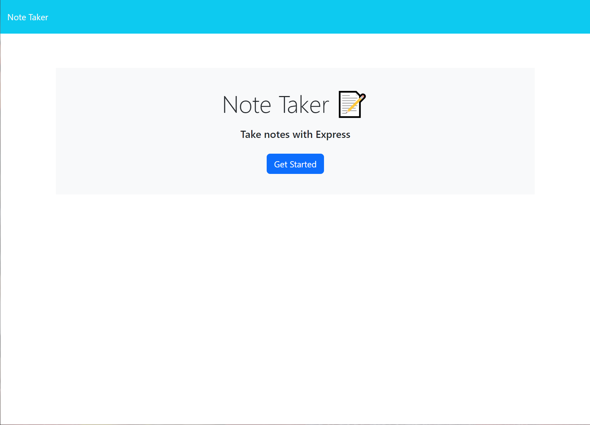
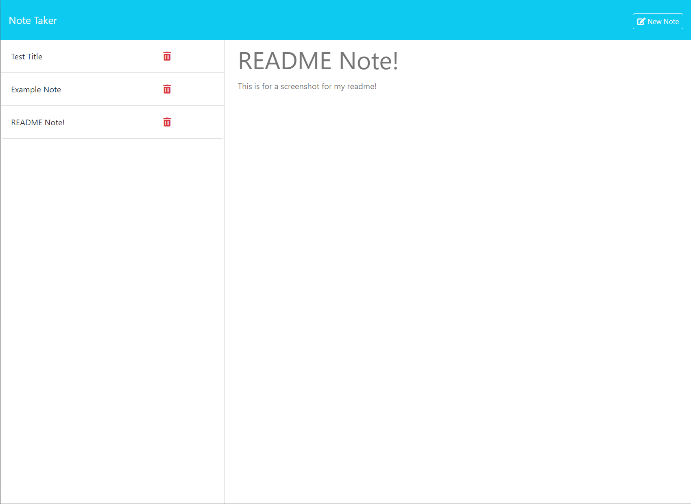

# Note Taker Project

## What is This Project?

This project is a Note Taker application designed to help users write and save notes.

- **Why Did I Make This?**: To practice and enhance my skills in JavaScript and Node.js by creating a dynamic and interactive note-taking application. This project also taught me more about using Express.js for building a backend server.
- **What's in It?**: The application includes a main page where users can view, add, and manage notes. Users can add new notes, delete existing notes, and view the details of each note. The notes are saved to a JSON file on the server, allowing for persistent data.
- **What Did I Learn?**: This project helped me understand the integration of various JavaScript libraries and as always, the importance of good console logs and error handling. I learned about setting up a server with Express.js, handling file operations in Node.js.

## Table of Contents

Explore the contents of this guide:

- [Installation](#installation)
- [Usage](#usage)
- [Screenshots](#screenshots)
- [Credits](#credits)
- [License](#license)

## Installation
Follow this link:
-  [Note Taker](https://note-taker-web.onrender.com) (May take up to a minute to load, please be patient).

OR:

To install and run this project locally:

1. Clone the repository: `git clone https://github.com/KitKatKernel/Note-Taker.git`
2. Navigate to the project directory.
3. Install the dependencies: `npm install`
4. Start the server: `node server.js`
5. Open your browser and go to: `http://localhost:3001`

## Usage
1. Click on "Get Started" to navigate to the notes page.
3. Use the form to add a new note with a title and text.
4. View the list of notes in the left-hand column.
5. Click on a note to view its details in the right-hand column.
6. Delete a note by clicking the "Delete" button on the note.
7. Notes are saved on the server and will persist between sessions.

## Screenshots

#### Landing Page

#### Notes Page

## Credits

A big thanks to my bootcamp instructors and peers for their continuous guidance and support. Special thanks to:
- [MDN Web Docs](https://developer.mozilla.org/) for comprehensive resources on JavaScript and Node.js.
- [W3Schools](https://www.w3schools.com/) for tutorials and references on web development.
- [Express.js Documentation](https://expressjs.com/) for detailed guides on using Express.js.
- [UUID Documentation](https://www.npmjs.com/package/uuid) for guidance on generating unique IDs.

## License

MIT License 

Permission is hereby granted, free of charge, to any person obtaining a copy of this software and associated documentation files (the "Software"), to deal in the Software without restriction, including without limitation the rights to use, copy, modify, merge, publish, distribute, sublicense, and/or sell copies of the Software, and to permit persons to whom the Software is furnished to do so, subject to the following conditions:

The above copyright notice and this permission notice shall be included in all copies or substantial portions of the Software.

THE SOFTWARE IS PROVIDED "AS IS", WITHOUT WARRANTY OF ANY KIND, EXPRESS OR IMPLIED, INCLUDING BUT NOT LIMITED TO THE WARRANTIES OF MERCHANTABILITY, FITNESS FOR A PARTICULAR PURPOSE AND NONINFRINGEMENT. IN NO EVENT SHALL THE AUTHORS OR COPYRIGHT HOLDERS BE LIABLE FOR ANY CLAIM, DAMAGES OR OTHER LIABILITY, WHETHER IN AN ACTION OF CONTRACT, TORT OR OTHERWISE, ARISING FROM, OUT OF OR IN CONNECTION WITH THE SOFTWARE OR THE USE OR OTHER DEALINGS IN THE SOFTWARE.
